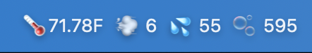

# AirDash

> Display AirGradient air quality measurements in your macOS menu bar

[](https://github.com/ljagiello/airdash/actions/workflows/go.yml)
[](https://github.com/ljagiello/airdash/releases/latest)
[](LICENSE)



## Features

- Real-time temperature, PM2.5, humidity, and CO2 levels in your menu bar
- Auto-refresh every 60 seconds (configurable)
- Clean, minimal menu bar interface
- Background daemon mode with automatic installation
- Native macOS app using AppKit

## Requirements

- macOS 11 (Big Sur) or later
- Apple Silicon (M1/M2/M3/M4)
- AirGradient sensor with API access

## Installation

### Option 1: Download DMG (Recommended)

1. Download the latest DMG from [Releases](https://github.com/ljagiello/airdash/releases/latest)
2. Open `AirDash-{version}-arm64.dmg`
3. Drag `AirDash.app` to the Applications folder
4. Launch AirDash from Applications
5. On first launch, it automatically installs itself as a background service

### Option 2: Standalone Binary

1. Download the latest release from [Releases](https://github.com/ljagiello/airdash/releases/latest)
2. Extract the archive:
   ```bash
   tar -xzf airdash_{version}_darwin_arm64.tar.gz
   ```
3. Run the binary:
   ```bash
   ./airdash
   ```

### Option 3: Build from Source

```bash
git clone https://github.com/ljagiello/airdash.git
cd airdash
go build
./airdash
```

**Requirements:** Go 1.25.4+ and Xcode Command Line Tools

## Configuration

Create `~/.airdash/config.yaml`:

```yaml
# Required: Your AirGradient API token
token: your-secret-token-here

# Optional: Specific location ID (0 = all locations, default)
locationId: 0

# Optional: Update interval in seconds (default: 60)
interval: 60

# Optional: Temperature unit - "C" or "F" (default: "C")
tempUnit: F
```

### Getting Your API Token

1. Log in to [AirGradient Dashboard](https://app.airgradient.com/)
2. Navigate to **Settings** → **API**
3. Generate a new API token
4. Copy the token to your `config.yaml`

### Configuration Options

| Option | Type | Default | Description |
|--------|------|---------|-------------|
| `token` | string | *required* | Your AirGradient API token |
| `locationId` | int | `0` | Specific sensor location (0 = all) |
| `interval` | int | `60` | Update interval in seconds |
| `tempUnit` | string | `"C"` | Temperature unit: "C" or "F" |

## Usage

### DMG Installation

1. **First Launch:** After dragging to Applications and launching, AirDash automatically installs itself as a background service
2. **Background Operation:** The app runs continuously in the background, fetching air quality data
3. **No GUI Required:** Once installed, the daemon runs headlessly - no menu bar needed
4. **Automatic Startup:** Starts automatically when you log in

### Standalone Binary

1. **Run once:** `./airdash` - runs in GUI mode with menu bar
2. **Install daemon:** `./airdash install` - sets up automatic background service
3. **Uninstall:** `./airdash uninstall` - removes background service

### Daemon Mode

AirDash runs as a LaunchAgent that continuously monitors air quality in the background.

**Features:**
- Fetches data at your configured interval
- Logs measurements in JSON format
- Automatically restarts if it crashes
- Starts automatically at login

**Managing the Daemon:**

```bash
# Check status
launchctl list | grep airdash

# View logs
tail -f ~/Library/Logs/airdash.log

# View errors
tail -f ~/Library/Logs/airdash.error.log

# Manual uninstall
./airdash uninstall
# Or for app bundle:
/Applications/AirDash.app/Contents/MacOS/airdash uninstall
```

**File Locations:**
- App: `/Applications/AirDash.app` (DMG install)
- Binary: `~/.local/bin/airdash` (standalone install)
- LaunchAgent: `~/Library/LaunchAgents/com.github.ljagiello.airdash.plist`
- Logs: `~/Library/Logs/airdash.log`
- Errors: `~/Library/Logs/airdash.error.log`
- Config: `~/.airdash/config.yaml`

## Troubleshooting

### No measurements showing

**Check your configuration:**
- Verify `~/.airdash/config.yaml` exists with a valid API token
- Ensure `locationId` matches your sensor (or use `0` for all sensors)

**Check the logs:**
```bash
# View recent logs
log show --predicate 'process == "airdash"' --last 5m

# View with more detail
log show --predicate 'process == "airdash"' --info --last 1h
```

**Common issues:**
- Invalid or expired API token
- Sensor offline or not reporting data
- Network connectivity issues

### App won't open or shows security warning

If you see a security warning:
1. Right-click the app and select **Open**
2. Click **Open** in the security dialog
3. Alternatively: System Settings → Privacy & Security → Allow

### HTTP/API Errors

If you see HTTP errors in logs:
- Check your internet connection
- Verify AirGradient API status at https://status.airgradient.com
- Confirm your API token is valid and hasn't expired
- Try accessing the API directly:
  ```bash
  curl "https://api.airgradient.com/public/api/v1/locations/measures/current?token=YOUR_TOKEN"
  ```

### App crashes or freezes

- Ensure you're on macOS 11 or later
- Check for updates: [Releases](https://github.com/ljagiello/airdash/releases)
- Report issues with crash logs: [GitHub Issues](https://github.com/ljagiello/airdash/issues)

### Daemon not starting or stopping unexpectedly

**Check daemon status:**
```bash
launchctl list | grep airdash
```

**View daemon logs:**
```bash
# View recent logs
tail -50 ~/Library/Logs/airdash.log

# View errors
tail -50 ~/Library/Logs/airdash.error.log

# Monitor logs in real-time
tail -f ~/Library/Logs/airdash.log
```

**Manually restart daemon:**
```bash
launchctl stop com.github.ljagiello.airdash
launchctl start com.github.ljagiello.airdash
```

**Reinstall daemon:**
```bash
./airdash uninstall
./airdash install
```

**Common daemon issues:**
- Config file missing or invalid - check `~/.airdash/config.yaml`
- API token expired - update your token in config
- Network connectivity issues - check internet connection
- Binary moved or deleted - reinstall daemon

## Development

### Local Development

```bash
# Clone the repository
git clone https://github.com/ljagiello/airdash.git
cd airdash

# Install dependencies
go mod download

# Run tests
go test -v ./...

# Run linter
golangci-lint run

# Build locally
go build -o airdash .

# Run
./airdash
```

### Project Structure

```
airdash/
├── main.go           # macOS UI and app entry point
├── airgradient.go    # AirGradient API client
├── config.go         # Configuration loading
├── log.go            # Structured logging
├── assets/           # Embedded assets (logo)
├── testdata/         # Test fixtures
└── .github/          # CI/CD workflows
```

### Running Tests with Coverage

```bash
go test -v -race -coverprofile=coverage.out ./...
go tool cover -html=coverage.out
```

### Creating a Release

Releases are automated via GitHub Actions. To create a new release:

1. Ensure all changes are committed and pushed to `main`
2. Create and push a version tag:
   ```bash
   git tag -a v0.0.2 -m "Release v0.0.2"
   git push origin v0.0.2
   ```

The GitHub Actions workflow will automatically:
- Build the arm64 binary
- Sign with Apple Developer ID
- Notarize with Apple
- Create a GitHub release with downloadable artifacts

**Release workflow:** `.github/workflows/release.yml`

### Required GitHub Secrets (for maintainers)

For signing and notarization, configure these secrets in your repository:

| Secret | Description |
|--------|-------------|
| `MACOS_SIGN_P12_BASE64` | Base64-encoded Developer ID certificate (.p12) |
| `MACOS_SIGN_PASSWORD` | Password for the .p12 certificate |
| `MACOS_NOTARY_KEY_BASE64` | Base64-encoded App Store Connect API key (.p8) |
| `MACOS_NOTARY_KEY_ID` | App Store Connect API Key ID |
| `MACOS_NOTARY_ISSUER_ID` | App Store Connect Issuer ID (UUID) |

See [Apple Developer documentation](https://developer.apple.com/documentation/security/notarizing_macos_software_before_distribution) for details on obtaining certificates and keys.

## API

AirDash uses the [AirGradient Public API v1](https://api.airgradient.com/public/docs/api/v1/).

**Endpoints used:**
- `GET /locations/measures/current` - All locations
- `GET /locations/{locationId}/measures/current` - Specific location

## Contributing

Contributions are welcome! Please read [CODE_OF_CONDUCT.md](CODE_OF_CONDUCT.md) before contributing.

**Guidelines:**
- Write tests for new features
- Run `golangci-lint run` before submitting
- Follow existing code style
- Update documentation as needed

## License

See [LICENSE](LICENSE) file for details.

## Acknowledgments

- Built with [DarwinKit](https://github.com/progrium/darwinkit) for macOS AppKit bindings
- Air quality data from [AirGradient](https://www.airgradient.com/)
- Logo design inspired by air quality monitoring
